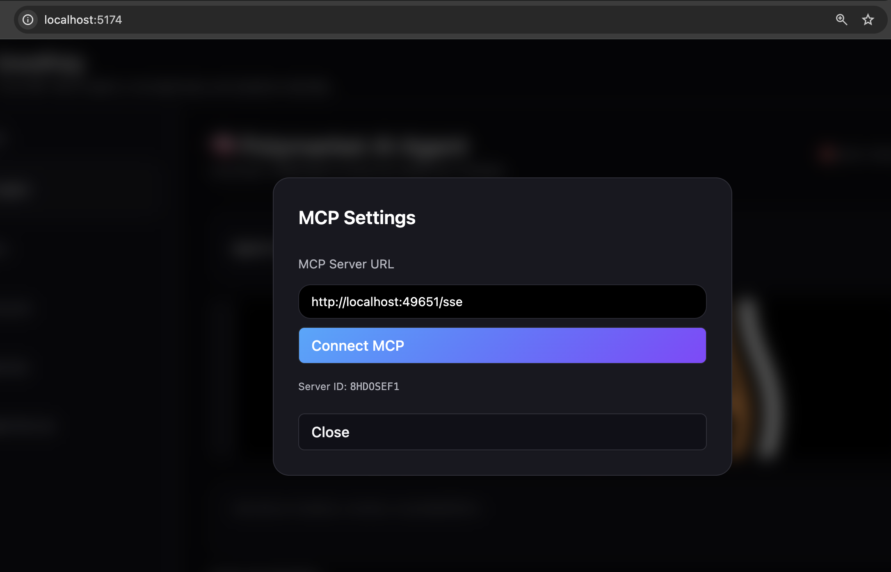

# 🚀 OmniPoly — Agentic Polymarket Platform

### _Built for the Nullshot Hackathon • MCP Agents • Automated Market Bots • Market Intelligence_

🎥 **Demo Video:**
https://www.youtube.com/watch?v=GiMBFlUf92E

[](https://nullshot.ai)
[](https://workers.cloudflare.com)
[](https://polymarket.com)

**OmniPoly** is a full agentic prediction-market toolkit that shows how an AI agent, empowered by **Nullshot MCP**, can autonomously:

- discover markets
- analyze market conditions
- activate trading bots
- stream updates
- trigger alerts
- and orchestrate an entire prediction-market workflow

All through **typed, safe, reproducible MCP tools**.

This project demonstrates the new reality of _agent → MCP → backend → automation_ — the core theme of the Nullshot Agentic Economy.

---

# 🎯 What OmniPoly Demonstrates

### 🔥 A real, working agentic loop

**“Agent → MCP Tool → Backend → Bot Activation → Live Monitoring”**

### 💜 Built entirely on Nullshot (core value)

Nullshot MCP handles:

- tool registration
- schema validation
- invocation routing
- SSE communication
- connecting LLMs to deterministic actions

### 📈 Polymarket made agent-friendly

AI-assisted discovery and real-time bot execution give users a smoother, more intuitive prediction-market experience.

---

# 🏗 Architecture Overview


### High-Level Flow

1. **User asks the AI agent**
2. Agent determines a tool is required
3. Agent calls a **Nullshot MCP tool**
4. MCP server routes request → backend bot system
5. Backend activates Market Mover bot + streams data
6. UI updates live with bot decisions & alerts

Nullshot is the glue across the entire system.

---

# 📂 Project Structure

```
polymarket-agent/
  agent/        → Frontend (Vite + React)
  backend/      → Cloudflare Worker backend (bot API + DB)
  mcp/          → MCP server providing agent tools
  contract/     → (Future) Smart contract integration
```

### **Agent (Frontend)**

- React + Vite UI
- AI Assistant chat interface
- Agent invokes MCP tools
- Bot dashboard + live price monitor
- Thirdweb integration (WIP)

### **Backend**

- Cloudflare Worker API
- Bot activation, status, and simulation logic
- SQLite / D1-based storage
- Market Mover Bot logic (mock execution loop)

### **MCP Server**

- Connects agent to backend tools
- Provides:

  - `run_market_mover`
  - `list_markets`
  - `intelligence` (WIP)
  - other Polymarket utilities (WIP)

- Implements Model Context Protocol (MCP)

---

# 🧠 Agent + MCP + Bot Interaction Flow (MVP)

1. **User chats with the AI agent**
2. Agent decides to activate a bot → calls MCP tool
3. MCP tool calls backend API
4. Backend starts Market Mover Bot
5. UI updates dynamically through polling
6. Bot sends live price updates + trigger notifications

This showcases how **autonomous agents** can manage Polymarket strategies through tool invocation.

---

# 🛠️ Installation & Setup

## 1️⃣ Start the Backend

```bash
cd backend
pnpm install
pnpm dev
```

This launches the bot API + D1 database.

---

## 2️⃣ Start the MCP Server

Open a second terminal:

```bash
cd mcp
cp .dev.vars.example .dev.vars
```

➡ **Set your BOT_BACKEND_URL**
Example:

```
BOT_BACKEND_URL=http://localhost:8787
```

Then:

```bash
pnpm install
pnpm dev
```

MCP server will start on a local port and register tools.

---

## 3️⃣ Start the Agent (Frontend)

Open a third terminal:

```bash
cd agent
cp .dev.vars.example .dev.vars
```

➡ **Set your OpenAI key**

```
OPENAI_API_KEY=sk-xxxx
```

➡ Also copy the example environment for backend URL:

```bash
cp .env.example .env
```

Fill in:

```
VITE_BACKEND_URL=http://localhost:8787
VITE_MCP_URL=http://localhost:xxxx   # MCP server port
```

Then run:

```bash
npm install
npm start
```

The app will open at:

```
http://localhost:5173
```

➡ **Once the frontend loads**:

1. Click “MCP Settings” (top-right gear icon).
2. Copy your MCP server URL (from the MCP terminal, usually http://localhost:<port>/sse)
3. Paste it into the MCP Server URL field.
4. Click “Connect MCP”.

Your agent is now fully connected to the Nullshot MCP server.

## 

# 🔧 Requirements

- Node 18+
- pnpm (recommended)
- Cloudflare Wrangler for backend
- OpenAI API Key
- Modern browser

---

# 🌐 Features (MVP)

### ✔ AI Agent

- Streams responses
- Calls MCP tools
- Detects tool results
- Triggers toast notifications when bots activate

### ✔ MCP Server

- Registers tools for Polymarket operations
- Supports agent → tool → backend interaction
- Includes type-safe schemas (zod)

### ✔ Market Mover Bot

- Activate via MCP tool
- Tracks Polymarket YES/NO prices
- Sends toast + audio alerts
- Threshold-triggered notifications
- Live chart-like tick streaming
- Bot status storage

### ✔ Clean UI

- Multi-tab layout (Agent / Bots / Analyzer / Markets / Thirdweb)
- Live Market Mover terminal
- Vite + Tailwind + React

---

# 📌 Future Direction

- Auto-trading strategies
- Arbitrage scanner
- Market intelligence agent
- Per-market risk scoring
- Multi-bot scheduling
- Thirdweb wallet-based execution
- On-chain strategy publishing
- Real Polymarket price feed integration

---
